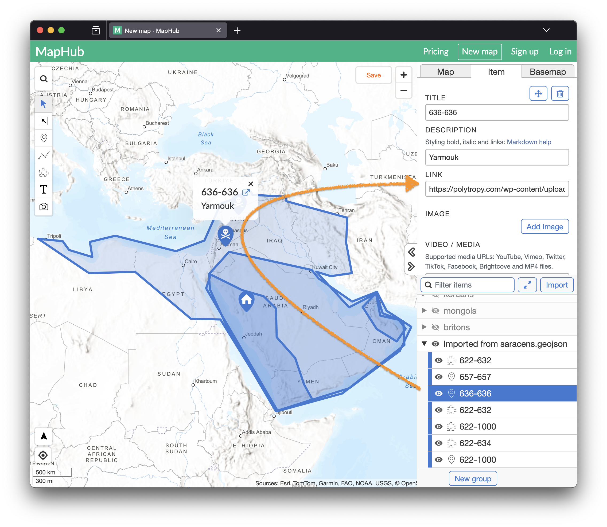
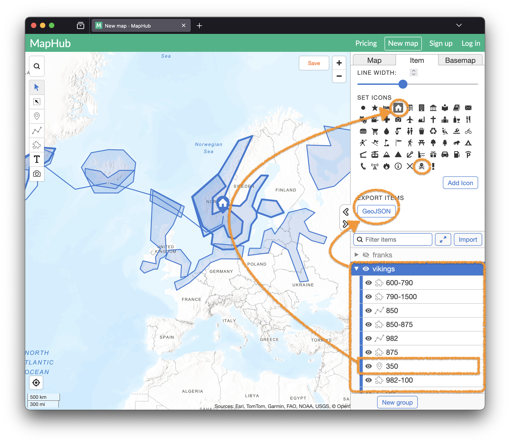

# beta
Beta version of a world map showing the territories of civilisations of Age of Empires 2.

# Age of Empires 2 -- Civilisation Map
<sup>(beta)</sup>

## Todo:
- [x] Age of Kings          (Classic)
- [ ] The Conquerors        (Classic)
- [ ] The Forgotten         (HD)
- [ ] The African Kingdoms  (HD)
- [ ] Rise of the Rajas     (HD)
- [ ] The Last Khans        (DE)
- [ ] Lords of the West     (DE)
- [ ] Dawn of the Dukes     (DE)
- [ ] Dynasties of India    (DE)
- [ ] Return of Rome        (DE)
- [ ] The Mountain Royals   (DE)
- [ ] Battle for Greece     (DE)
- [ ] The Three Kingdoms    (DE)

*All help is welcome!*

## Data Format

### GeoJSON

#### `vikings.geojson`
```json
{
    "type": "FeatureCollection",
    "features": [
        {
            "type": "Feature",
            "geometry": {
                "type": "Polygon",  // obligatory choice 
                    //  "Polygon", "LineString", "Point"
                "coordinates": [    // obligatory
                    [
                        [
                            11.796021,
                            60.582127
                        ],
                        // ...
                        [
                            11.796021,
                            60.582127
                        ]
                    ]
                ]
            },
            "properties": {
                "title": "600-790",     // flexible
                "description": "home",  // optional
                "stroke-width": 4,      // optional
                "marker-symbol": "house", // optional for Point
                "url": "https://en.wikipedia.org/wiki/Vikings#/media/File:Vikings-Voyages.png" // optional
            }
        },
    ]
}
```

#### Explanation
- type: Feature (fixed as exported, see below)
- geometry: longitude and latitude used for placement
  - type: One of "Polygon", "LineString", "Point"
  - coordinates: list of data points
- properties:
  - title: used for time period from year to year as integers in range [0,1700] either
    - `start` or
    - `start-end`
  - description: displayed text information
  - url: link to sources
  - stroke-width: number in range [0,10] used for opacity (normalized to 1) of elements (4 is default)
  - marker-symbol: 
    - `"house"` for a house symbol
    - `"danger"` for a battle/swords symbol
    - everything else would result in just a circle

## How to Add a Civilisation

1) Add an entry for a civilisation to `data/meta_data.json` with the proper name, a color of choice and the filename for the data:</br> 
    ```json
    {
        "name": "vikings",
        "color": "#66d2ea",
        "file": "vikings.geojson"
    },
    ```
1) Place the `.geojson`-data in the data-subfolder.


## How to Get a `.geojson`-File

We used the online editor at [maphub.net](https://maphub.net/map) to draw territories and set properties.
- Easy modification of each element
- Grouping
- Import / Export



Necessary steps:
1) Create a group and name it after the civilisation
   - Alternatively, import a file to modify or extend it
2) Draw a line, polygon or set a marker 
   - Choose an icon (optional, eg. for battles)
3) Title it with the appropriate starting time (from when it should be displayed) or time span
4) Move all elements into the group
5) Export the group

